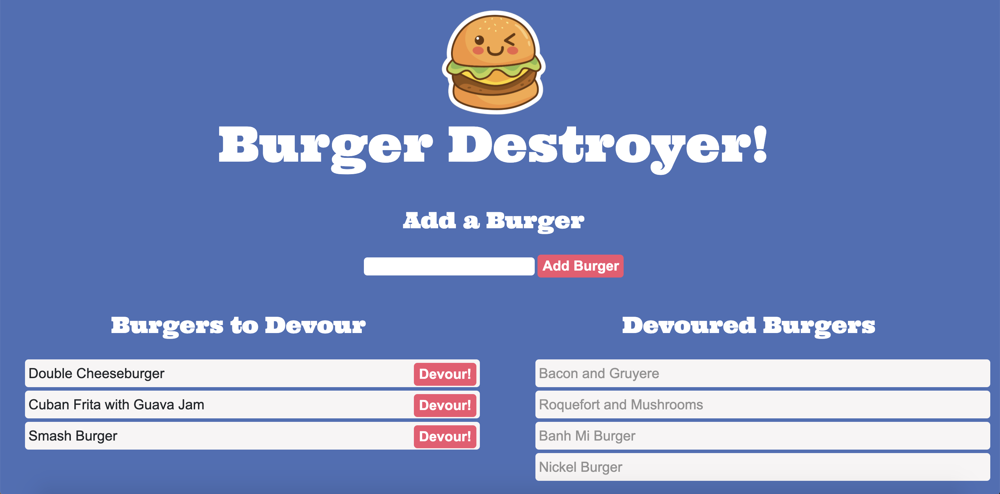

# Burger Destroyer README

# Table of contents
1. [Project Description](#descriptionLink)
2. [Deployed Link](#deployedLink)
3. [UI](#uiLink)
4. [Version](#versionLink)
5. [Dependencies](#dependenciesLink)
6. [Contact](#contactLink)

----

## Project Descripton 
A restaurant app that lets users input the names of burgers they'd like to eat.

## Deployed Link 
-[Burger Destroyer](https://secret-falls-51153.herokuapp.com/)

## UI 

## Version 

## Dependencies 
-Express

-mysql

-express-handlebars

-[Shields.io](https://shields.io/) - Badges for readme

## Contact 

 
#### Github Username: [@reyesdmusic](https://www.github.com/reyesdmusic)
#### Email: reyesdmusic@gmail.com